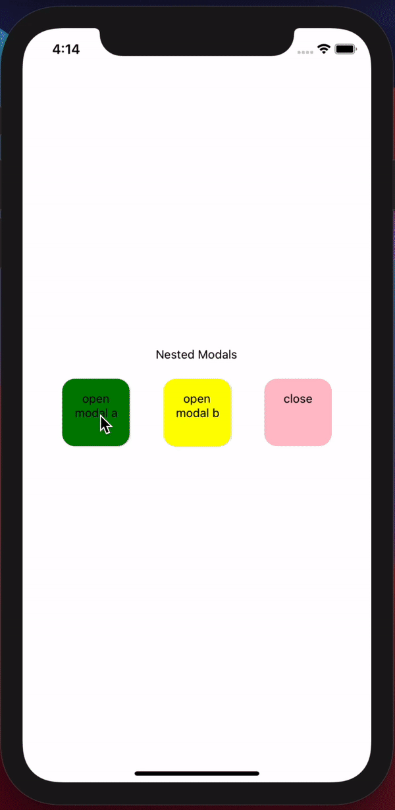

# react-native-nested-modals




## Installation

```sh
npm install react-native-modal react-native-nested-modals
```

This package built on top `react-native-modal`, make sure it installed in your project
## Usage

```js
import { ModalsProvider } from 'react-native-nested-modals';

// ...

 <ModalsProvider>
   <App />
 </ModalsProvider>
```
Inside the wrapped component

```js
import useNestedModals, { INestedModalsContext } from 'react-native-nested-modals';

// ...
const { openModal, closeModal, closeAllModals }: INestedModalsContext = useNestedModals();
 
```


**To do** - Create method for `MyModal` props manipulation on run time

## Speical types

```js
type TModalProps = {
  withClickOutside?: boolean;  // defalut -> false
  onClickOutside?: () => void; // defalut -> useNestedModals().close  
} & Partial<ModalProps>;;


interface INestedModalsContext {
  closeModal: (idx?: number) => void; // modals.length - 1
  openModal: (MyModal: ReactElement, modalProps?: TModalProps) => number; // default -> **REQUIRED**, {} => new modal idx
  closeAllModals: () => void;
}

```

List of full `react-native-modal` `ModalProps` can be found [here](https://github.com/react-native-modal/react-native-modal/blob/master/README.md)


Unlike `react-native-modal`, `isVisibile` alwayes set to `true`, in case you want to close a modal, just call `close` method. 


**To do** - Support for `modalProps` manipulation and re-render accords


Full working [example](example/src)


## Contributing

See the [contributing guide](CONTRIBUTING.md) to learn how to contribute to the repository and the development workflow.

## License

MIT
